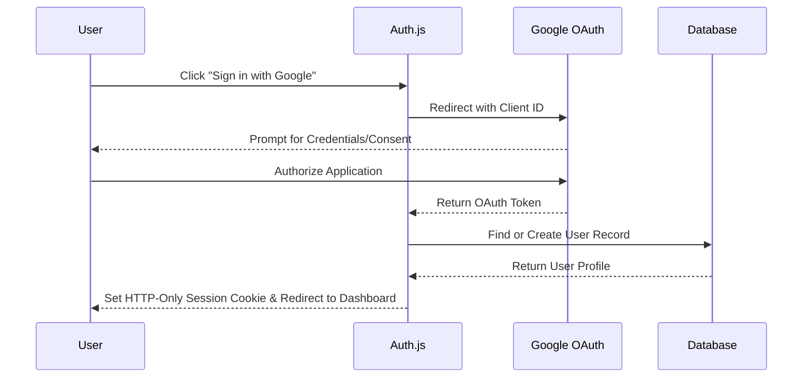
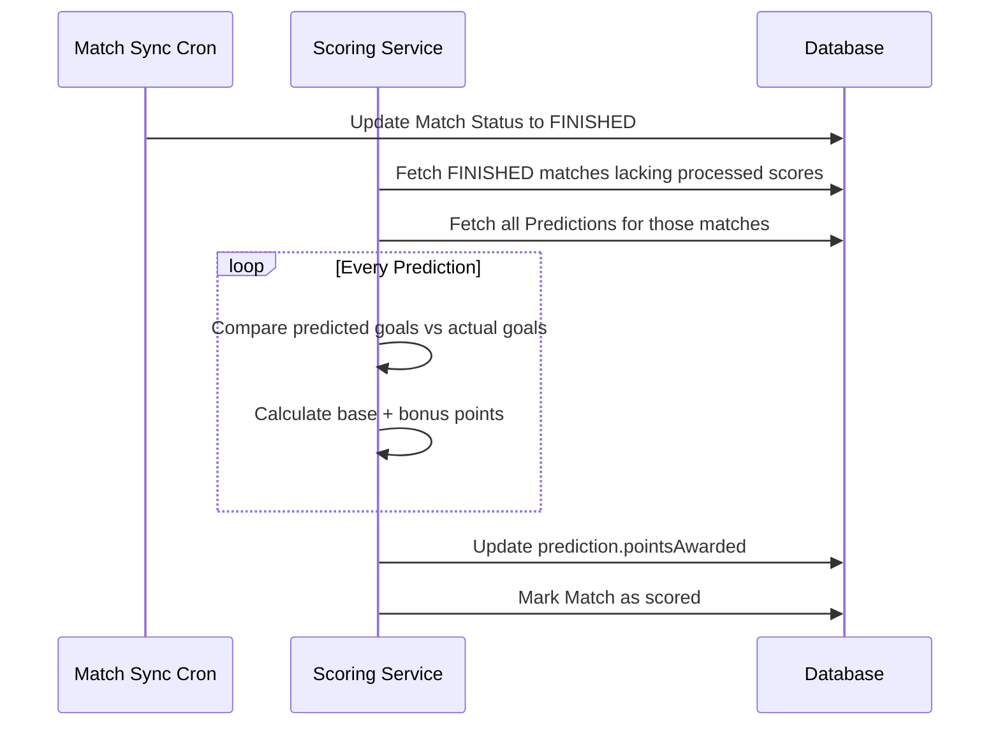
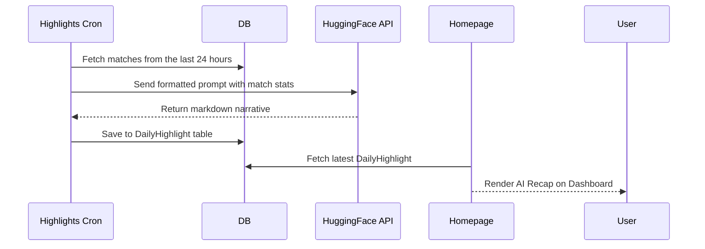
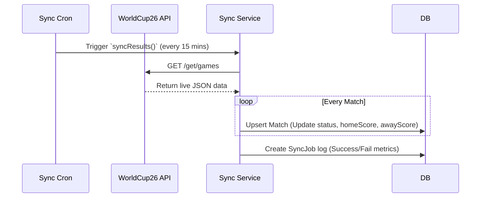

# System Architecture

This document outlines the high-level architecture, data flow, and core APIs of the FIFA 2026 Prediction App.

## 🏗 System Overview

The application is built on the **Next.js App Router** paradigm, heavily utilizing Server Components for fast initial loads and Server Actions for secure, JavaScript-free form submissions and data mutations. **Prisma ORM** serves as the data access layer connecting to a **PostgreSQL** database. 

Background processes (like fetching live match results and generating AI highlights) are handled by a dedicated `instrumentation.ts` script running **node-cron** tasks in the Node.js runtime.

---

## 🔀 Data Flow Diagrams

### 1. Authentication Flow
The application uses Auth.js (NextAuth) exclusively with Google OAuth.

### 2. Prediction Scoring Flow
Scores are automatically calculated via a background cron job once a match is marked as `FINISHED`.

### 3. AI Highlights Flow
Daily recaps are generated by querying recent match data and feeding it to a Hugging Face LLM.

### 4. Match Sync Flow
The system synchronizes with the external `worldcup26.ir` API to keep fixtures and scores up to date.

---

## 🔌 API Documentation

While the application primarily uses Server Actions instead of traditional REST endpoints, here are the critical entry points of the system.

### Server Actions (`src/actions/`)

These functions are called directly from React Client Components but execute securely on the Node.js server.

- `createPredictionAction(formData: FormData)`: Validates user input (home goals, away goals) and creates/updates a `Prediction` record in the database.
- `updateUserAction(formData: FormData)`: Admin-only. Updates a user's role or total points. If points are updated, it reverse-calculates the underlying `bonusPoints` delta to ensure leaderboard integrity.
- `syncTeamsAction() / syncMatchesAction()`: Admin-only. Triggers manual synchronization with the WorldCup26 API, bypassing the cron schedule.
- `generateHighlightsAction()`: Admin-only. Forces the immediate generation of a new AI Daily Highlight.
- `recalculateAllScoresAction()`: Admin-only. Wipes all current prediction scores and re-evaluates every prediction in the database against finished matches.

### API Routes (`src/app/api/`)

Traditional Next.js Route Handlers exposed over HTTP.

- **`GET /api/auth/[...nextauth]`**: Handled dynamically by Auth.js to manage login, callbacks, and session retrieval.
- **`GET /api/matches/[id]/insights`**: 
  - Called by the Match Insights modal. 
  - Queries the database for existing AI facts. 
  - If `< 20` facts exist, it calls the Hugging Face Inference API, caches 4 new facts, and returns them.
  - Returns a random sample of 4 cached facts.
